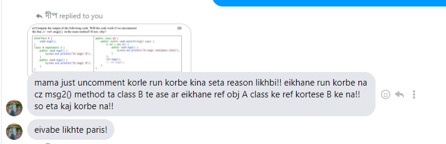

# Output of 4 (a)

```
Inner catch: Even integer found
I don't care about exceptions
Outer catch: Negative value not allowed
```


# Output of 4 (b)

```
ID is 011201158 , name is: Md. Fahim Bin Amin
```

# 4(c)



If we uncomment ref.msg2() in the main method, then we will get an error.

Error 1: 
```java
Cannot resolve method 'msg2' in 'A'
```
Solution:
We need to create method 'msg2' in 'A'

Error 2: 
```java
Class 'Anonymous class derived from A' must either be declared abstract or implement abstract method 'msg2()'
```
Solution:
add this part in the main method:

```java
@Override
            public void msg2() {
                
            }
```

The the full complete and working code will be:


```java
interface A{
    void msg1(); void msg2();
}
class B implements A{
    public void msg1(){
        System.out.println("In msg1: B");
    }
    public void msg2(){
        System.out.println("In msg2: B");
    }
}
public class Q3{

    public static void main(String[] args) {
        A ref = new A(){
            public void msg1(){
                System.out.println("In msg1: anonymous class");
            }

            @Override
            public void msg2() {

            }
        };
        ref.msg1();
        ref.msg2();
    }
}

```